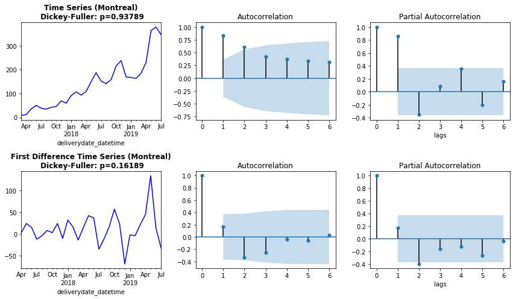

# Sales Forecast

This was a problem given to me by a company to forecast the order volume for August 2019 in the three different cities it operates in. To tackle this problem, pre-processing and transformation of the data was first performed to ensure stationarity. Subsequently, time series models were implemented with grid-search and with day forward chaining cross validation in order to optimize hyperparameters and mitigate overfitting. Inspection of the residuals, mean absolute percentage error scores as well as comparisons with a baseline model were performed. Accurate predictions of order volume can be helpful for anticipating spikes and dips in orders but also allow more appropriate pricing of items.

## EDA
Upon loading and inspection of the T1 dataset, exploratory data analysis revealed that Austin presented significantly smaller number of deliveries and history than Toronto and Montreal. Counts of deliveries were also computed with a monthly-bin resolution. While binning at a higher temporal resolution may be attractive, the data becomes relatively noisy. For example, binning with temporal resolution of days generate largely sparse dataset while binning in weekly intervals presents a complication that weeks can run across different months, making prediction for just the month of August difficult.

## Data Preparation and Model Selection
Before the selection of a time series model, inspection of plots, summary statistics and statistical tests were performed to identify possible trends, seasonality, autoregression elements, and amount of differencing required to achieve stationarity. Specifically, time series were plotted with its autocorrelation and partial autocorrelation functions as shown in the figure below to gain insight on the order of MA and AR terms respectively. Dickey-Fuller tests were also computed to test whether unit root is present in the time series.

It is evident that both the time series and first-order-differenced time series were not stationary through the varying spread of values and the increasing mean values with time. Indeed, this was consistent with the Dickey-Fulley test (p > 0.05). A log-transformation was subsequently applied with results shown below that shows the same calculations as in the figure above. The Dickey-Fuller test now indicates that stationary is achieved with first-order differencing and the number of significant peaks in the ACF and PCF have dropped. With stationary achieved and the absence of seasonality, the ARIMA model was subsequently selected as a forecast model for Montreal and Toronto. With only five months of time series data points available in Austin, ARIMA is inappropriate. Given the evident upward trend in Austin’s time series, the Holt linear trend (double exponential smoothing) method was used to forecast the order volume.

## Grid Search and Cross-validation
For both ARIMA and Holt’s linear model, grid search with cross validation of the optimal hyperparameters was implemented. It is important to note that the standard k-fold cross validation technique is not appropriate for time series analysis given the possibility of data leakage, temporal dependencies between data points and inaccuracy in simulating the forecasting environment. Instead, a walk-forward validation was performed where the training set consists of only observations that occur prior to the test observation, with no information from future observations used for constructing the forecast. The forecast accuracy was subsequently evaluated by averaging over the mean absolute percentage error (MAPE) of the next test data point. This procedure is illustrated below. Hyperparameters tuned included p (number of AR terms), q (number of MA terms), and d (number of differences) for ARIMA while the level and trend smoothing terms were tuned for Holt’s linear model.

## Results and Discussion
The figure above presents the forecasts and actual order volumes in the three cities, while Table#1 shows the numerical predictions (rounded to the nearest whole number) as well as the averaged MAPE computed (next time point prediction) during cross-validation for the optimized model. A naive persistence baseline model was also implemented with results displayed in the last two columns of the table.

Upon model fitting the ARIMA models, model diagnostics were also performed to check whether any assumptions were violated. Figure below presents a diagnostic performed from the Montreal data. We observed from the top-right histogram and in the qq plot that the residuals appear to be normally distributed. Moreover, the residuals does not display any obvious seasonality trends, which is confirmed by the correlogram.

## Challenges
One of the challenges in this problem was the selection of time series models with the relatively small number of time series data points. While some textbooks and papers provide a rule-ofthumb for the minimum number of samples required for different models, these could be misleading and unsubstantiated in practice. Besides the theoretical limit of the number of parameters estimated in the model, the amount of noise in our dataset could also affect the sample size required. Preparing the data was also another important and challenging aspect for trying to establish stationarity before model implementation. Nevertheless, a limitation of this study would be the small number of data points used to build the time series models. While cross-validation with grid search was performed, the relatively small number of data points may also contribute to overfitting.

## Future Directions and KPIs
Beyond predicting what the overall order volume would be in each city, I think it would be very interesting to be able to forecast the order volume of different items in the catalog. Not only would this allow Renorun to forecast possible shortages of supply in the near future but also allow better pricing of items and deliveries. This could be achieved with the merge of tables T1 and T2, although a greater number of item entires may be needed from table T2. Another interesting idea would be to predict order volumes for different users. In combination with Part 2 of the technical challenge, one could develop personalized recommendation systems for users of what to buy next on the app. KPIs for the developed forecast models could include the evaluation of how accurate the order volume predictions are for August 2019, and for how long before the model would need to be re-trained again. Importantly, measuring whether the model can pick up and anticipate large spikes in orders would also be a useful indicator.
